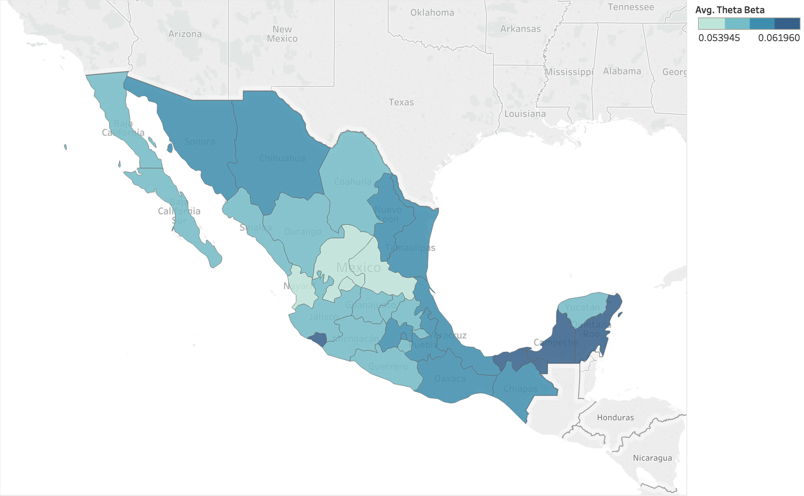

```{r, include=FALSE}
## Don't forget to fill in the missing values for [...]
```

```{r setup, include=FALSE}
knitr::opts_chunk$set(echo = TRUE)
```

```{r Imports, include=FALSE}
library(rstan)
library(tidyverse)
library(ggplot2)
library(gridExtra)
library(bayesplot)
options(mc.cores = parallel::detectCores())
rstan_options(auto_write = TRUE)
```

```{r Files, include=FALSE}
file <-  '../DBs/core.txt'
file_mode_betabin <- './zip_code_v01.stan'
```

The current document is ordered in the following manner. First, I set the context of the problem by describing the data set and some key features about it. Here I also re-state the questions that we (the start-up and I) want to answer. Next I show some preliminary models that I ran in order to make sense of the data. The idea is to find the set variables that we should include in the final model and to understand at what level of granularity are those variables meaningful. Then I show a proposal of a graphical model that I then plan to estimate via VI. Finally, I conclude with a pipeline of models that I will be running in the following month as well as some questions where I would like to get some feedback on.

# Setting the preamble

```{r Load the data, include=FALSE}
data <- read_delim(file = file, delim = '|')

# Sample the data
pct = 1
# pct = 0.1
# pct = 0.01
set.seed(seed = 42)
sample_size = round(pct * nrow(data))
sample <- sample(x = nrow(data), size = sample_size, replace = F)
data = data[sample, ]

## Selecting the relevant columns for the analysis
data_sub <- data %>% select(client_income,
                        ratio,
                        age,
                        sex_F,
                        condition_U,
                        effective_pay,
                        factor_employed,
                        inv,
                        risk_index,
                        y)
summary(data_sub)

## Filter incorrect values
inputs <- data_sub %>% 
  filter(risk_index > 0,
         effective_pay > 0)
print('Filtering makes us')
print(dim(inputs))
y = inputs$y
inputs <- inputs %>% select(-y)
summary(inputs)

## Rescaling
inputs <- inputs %>% 
  mutate_at(.funs = scale, .vars = c('client_income',
                                     'ratio',
                                     'age',
                                     'effective_pay',
                                     'factor_employed',
                                     'risk_index'))


## Creating the data set for the zip code analysis
data_sub <- data %>% 
  group_by(state, city, zip) %>% 
  summarize(cases = sum(y),
            counts = n(),
            theta_emp = cases / counts) %>% 
  arrange(desc(cases)) %>% 
  ungroup()
summary(data_sub)

## Shuffle
sample_entries <- sample(x = nrow(data_sub), size = nrow(data_sub), replace = F)
data_sub = data_sub[sample_entries, ]

## Create inputs for STAN
y_beta_bin = data_sub$cases
N_z = data_sub$counts
inputs_stan = list(M=nrow(data_sub), N=N_z, y=y_beta_bin)
```

The data set was provided by a mortgage lending start-up company in Mexico. This data set consists of __30,499 mortgages with over 90 covariates__ (where some of features are simply administrative and thus were not included in the analysis). __The average default rate is 6%__. Also, the data set provided was __their latest report available at August 2018__; if needed, I could incorporate historical information of previous months. Some of the key variables are:

* __[Location]__ `state`, `city` and `zip`: These features will allow me to understand if the client's behavior varies by geography. Also, I have this location features for both the house acquired and for the owner's location.

* __[Demographics]__ `age`, `sex`, `ratio`, `risk_index`, `client_income` and `credit_score`. The feature `ratio` is the % of the client's income that the monthly payments for its mortgage represent. The `risk_index` is a variable that combines several metrics associated with his likelihood of paying a debt. The `client_income` feature is the monthly income that the person earned at that moment in time when she signed the mortgage. Finally, the ordinal variable `credit_score` evaluates how the client has performed in previous debts (related to `risk_index`).

* __[Asset features]__ `vendor name`, `new_used`, `inv` and `appraisal_value`: These features tell us who was the vendor (either a construction company or an individual), if the asset is new or not, then `inv` (made up feature) is a dummy variable that takes the value of 1 if the house bought is in the same state where the owner lives and the last variable is the price of the asset.

* __[Employment]__ `employer_name` and `factor_employed`. The first feature conveys who is the employer and the second one information about the client's status of employment.

* __[Payment Records]__ `days_pay`, and `y`. The first feature counts the number of days that have passed between the last payment date and the date on which the mortgage started. The next feature is the target variable that is 1 if the mortgage has at least one month without a payment and 0 otherwise. 

Note that features like `interest_rate` and `contract_length` are present but have no variance. The current _product offer_ in the data base is a 12% interest rate mortgage for 30 years. Thus it is impossible to pose counter factual questions for those variables. 

The empirical distribution of some of the previous key variables is

```{r Display all, echo=FALSE}
market_value <- data %>% filter(asset_market_value < 1600000)
ratio_hist <- data %>% filter(ratio > 0.20)
risk_hist <- data %>% filter(risk_index > 1900, risk_index < 2400)
zip_hist <- data %>% group_by(zip, state, city) %>% 
  summarize(mean_income = mean(client_income)) %>% 
  arrange(desc(mean_income)) %>% 
  ungroup()

## Market value distribution
g1 <- ggplot(data = market_value, mapping = aes(x = asset_market_value / 1000)) +
  geom_histogram(fill='lightblue', color='black', bins = 30) +
  labs(title = 'Houses concentrated at $300-600',
       subtitle = 'Asset Market value distribution') +
  ylab(NULL) +
  xlab('K MXN') +
  theme(plot.title = element_text(size = 10, face = "bold")) +
  theme(plot.subtitle = element_text(size = 8)) +
  theme(axis.title.x = element_text(size = 8))

## Ratio distribution
g2 <- ggplot(data = ratio_hist, mapping = aes(x = ratio)) +
  geom_histogram(fill='lightblue', color='black', bins = 30) +
  labs(title = 'No over 30% mortgages',
       subtitle = 'Ratio (Mortgage / Income) distribution') +
  ylab(NULL) +
  xlab('ratio') +
  theme(plot.title = element_text(size = 10, face = "bold")) +
  theme(plot.subtitle = element_text(size = 8)) +
  theme(axis.title.x = element_text(size = 8))

## Risk index distribution
g3 <- ggplot(data = risk_hist, mapping = aes(x = risk_index)) +
  geom_histogram(fill='lightblue', color='black', bins = 30) +
  labs(title = 'Similar risks measurements',
       subtitle = 'Risk index distribution') +
  ylab(NULL) +
  xlab('risk index (points)') +
  theme(plot.title = element_text(size = 10, face = "bold")) +
  theme(plot.subtitle = element_text(size = 8)) +
  theme(axis.title.x = element_text(size = 8))

## Zipcode income distribuion
g4 <- ggplot(data = zip_hist, mapping = aes(x = mean_income)) +
  geom_histogram(fill='lightblue', color='black', bins = 30) +
  labs(title = 'Severly skewed',
       subtitle = 'Income per zipcode distribution') +
  ylab(NULL) +
  xlab('MXN') +
  theme(plot.title = element_text(size = 10, face = "bold")) +
  theme(plot.subtitle = element_text(size = 8)) +
  theme(axis.title.x = element_text(size = 8))

## Diplay all the graphs
gridExtra::grid.arrange(g1, g4, g2, g3,
                        layout_matrix = rbind(c(1, 2), 
                                              c(3, 4)))
```

# Understanding the data

Personally, the best way to understand a data set is to run different models and see where they fail. I ran the next set of models in `STAN`. Monte Carlo sampling is adequate for this aggregate top-down analysis, however, for the final model the complexity will require us to derive VI updates.

__Model 1 (Simple Logistic Regression)__:

$$
\beta \sim N(\mu, \sigma ^ 2)
$$
$$
y_i \sim Ber(logistic^{-1}(X \beta))
$$
where $i=1, \dots ,N$ where $N$ is the total number of mortgages. Also, $X$ is augmented to include an intercept and the covariates where standardize. The results are the following.

\newpage

```{r Run first STAN model, include=FALSE}
inputs_stan_reg = list(N=nrow(inputs), D=ncol(inputs), X=inputs, y=y)
sm <- stan_model('./logistic_reg_v01.stan')
sm.logistic1 = sampling(sm, data=inputs_stan_reg, iter=1000, chains=4)
```

```{r Print resutls of logistic regression, echo=FALSE}
print(sm.logistic1, digits = 1)
```

The order of the variables is the following: `client_income`, `ratio`, `age`, `sex` (dummy), `new_used` (dummy), `days_pay`, `factor_employed`, `inv` and `risk_index`. At this aggregate level the only relevant variable appears to amounts of days that the client has payed his mortgage `days_pay` and the intercept $\alpha$.

__Model 2 (Location Hierarchical Logistic Regression)__:

$$
\alpha \sim Ga(a_0, b_0)
$$
$$
\beta \sim Ga(a_0, b_0)
$$
where for each zip code
$$
\theta_j \sim Beta(\alpha, \beta)
$$
$$
y_j \sim Bin(n_j, \theta_j)
$$
where now $y_j$ represents the accumulated cases of default per zip code. The idea here it to uncover if there are some areas that are more prone to default. The results are summarized in the next plot.

```{r Generate data for the first approach, include=FALSE}
compile_betabin <- stan_model(file_mode_betabin)
sm.betabin = sampling(compile_betabin, data=inputs_stan)
```

```{r Print results of beta-binomial, echo=FALSE}
print(sm.betabin, digits=1, pars = c('alpha', 'beta', 'lp__'))
```

where we see, as expected, that the parameters of the shared beta prior lean towards low values of $\theta_j$. Note also how this model yielded a much higher log posterior than the vanilla logistic regression.

```{r Extract sims betabin, echo=FALSE}
## Extract simulations
sims.betabin = rstan::extract(sm.betabin)
theta.betabin = apply(X = sims.betabin$theta, MARGIN = 2, FUN = median)
data_sub$theta.betabin = theta.betabin

## Generate plot
ggplot(data = data_sub, mapping = aes(x = theta.betabin, y = theta_emp)) +
  geom_point(color = 'grey') +
  geom_point(aes(x = theta.betabin, y = theta_emp), color='blue') +
  ylim(0, 1) +
  labs(title = 'Information sharing achieves reasonable estimates',
       subtitle = 'Hierarchical Logistic Regression estimates of default rates per zip code') +
  ylab('Observed default rate') +
  xlab('Estimated default rate') +
  theme(plot.title = element_text(size = 12, face = "bold")) +
  theme(plot.subtitle = element_text(size = 10)) +
  theme(axis.title.x = element_text(size = 10))
```

Also, the estimates are pooled towards their group mean, yet, there are still some zip codes that have a higher probability of default than others. Thus, one of the main insights is that we should model each spatial unit differently.

\newpage



\newpage

Moreover, the data is consistent with our hypothesis that conflict areas in Mexico are having a collateral effect on the ability of the people to pay their mortgage. The northern states of Mexico are some of the wealthiest states but also the states colored in darker blue are exactly where a drug war is taking place (Sonora, Chihuahua, Nuevo Leon and Tamaulipas). Yet, this map is also consistent with the notion that poor areas tend to default more. For example, the lower part of Mexico (Veracruz, Oaxaca and Chiapas). However, what is surprising is the selection of the darker states (Colima, Campeche and Quintana Roo) since there is not clear explanation of why this is the case.

\newpage

## Questions we want to answer

Below I restate the questions that we want to answer (in order of importance):

* __Why do people default?__: Generally put, this is the question that will enable us to answer all the questions below but, even though it is easy to understand, it is hard to pin down formally. Next are our main hypothesis of why people default. One hypothesis is that the customer might have run into some financial difficulties. Another hypothesis is that the customer might not like the property that she bought and thus abandon it. Yet another hypothesis is that some conditions in the area where the customer lives have made him move away and thus abandon the property. One final hypothesis is that the customer has bought this asset as an investment but it is not interested in keeping it anymore. The answer might be a mixture of all these plausible stories, yet we want to uncover which is more consistent with the data and an appropriate model formulation to address each.

* __Why are some geographical areas more prone to default?__: Since 2010 Mexico started a drug war against different cartels located throughout the country. Still today in 2018, there are some states that are still in conflict. We want to understand what is the collateral damage that this event has on the ability of people paying their mortgages in those areas. Also, as seen in the previous analysis, we have uncover that some states where there is a drug conflict should a higher probability of defaulting.

* __Are there some untruthful vendors?__: We have been told that one of the main reasons that people default is because some vendors enticed the customers into buying some house that they ended up not liking.

* __How likely is someone to default?__: This is a prediction question that is fully covered with logistic regression. However, as seen above, it is needed that we expand our logistic regression model since the off-the-shelf approach is not separating the data satisfactorily. 

\newpage

# Proposing models to address these questions

We want to construct a model that captures the trade-offs that each person undergoes every month when deciding whether to pay its mortgage loan or not. It appears that this trade-off boils down to two latent quantities $\zeta_i$ and $I_i$ where $i = 1, \dots, N$ and $N$ is the total number of mortgages in the data base. The parameter $\zeta_i$, which is a number between $[0, 1]$, represents the percentage of the income that this individual is willing to give in order to pay her mortgage. Thus, if the customer does not like her house then we would expect $\zeta_i$ to be low but, if customer has all her dependents living inside, then $\zeta_i$ should be close to 1. $I_i$ is latent because even though we have an observation of the client's income when he signed the contract, we cannot assure that this stays constant over time (for example, the client might lose its job or acquire other liabilities). By design, this two latent quantities merge together so that
$$
\Pr[Y_i=1|X_i] = logit^{-1}(\zeta_i I_i)
$$
hence the center of the model boils down into modeling $\zeta_i$ and $I_i$. There are two main topics to address: (1) what functional forms to give to each latent variables (in order to connect them to the covariates) and (2) how is the information shared across the graphical model. In principle, the functional form of $\zeta_i$ could be shared across all individuals but its value would only change depending on the person's covariates. In contrast, $I_i$ should be shared only across similar spatial units. Thus far we are thinking

$$
\zeta_i = logit^{-1}(\alpha + X \beta)
$$
where $X$ contains only covariates related to the person's likelihood to assign more money to its mortgage. For example, `risk_index`, `age` (as a proxy for family dependents), `sex` and `new_used` and `inv`. In terms of the other latent variable

$$
I_i = I_j^{zip} + I_i ^ {job} - M_i
$$
where $I_j ^ {zip}$ relates to the average income level of that zip code, $I_i ^ {job}$ to the salary that she ears and $M_i$ relates to the mortgage amount she has to pay. Note that this approach will allow us to pair individuals with similar $\zeta_i$s or similar $I_i$ and thus understand how default changes between those matched groupds.

The graph for the previous model is ($z_i$ represents the observed assignation of the individual to its zipcode):

\vspace{20em}

\newpage

# Laying out concerns for feedback

Our main concerns are:

* __Do we have the information necessary to address our research questions?__ Does the data that I presented in the first section appears suitable to address our questions? Is there anything that we might be asking that is ill-posed and would not be able to be seen from our data? Are we able to draw any type of causal inferences with our data? 

* __Are we posing a model that will allow us to derive the insights that we want?__ We are afraid that maybe the idea of modelling $\zeta_i$ and $I_i$ might be too restrictive as a family of models. Or that it might be really hard to estimate due to its functional form. Related to this, the inference is also complicated since we do not have a conjugate family and thus it will requires to use gradient reparameterizations. We are also worried that we might be complicating our approach more than it is necessary. Should we better try to estimate a simpler model like a linear logistic regression where we shared the parameters according differently (for example base $\beta_{income}$ we shared across zip codes but the $\beta_{age}$ we share across all individuals). 

* __Would incorporating historical data help us make any causal inferences?__ Our questions are centered about knowing why something happened. Furthermore, we have the same data for previous periods. Do you think that any of our research questions might benefit from introducing the historical values of the same covariates? Also, howshould we introduce this historical dependencies in our model?

* __Is there any way to construct a possible embedding?__ It would be really interesting to project all the features into a lower dimensional space and see how the data is grouped together. However, it is not evident neither what we could use as interactions nor what would we be making the interactions between.
