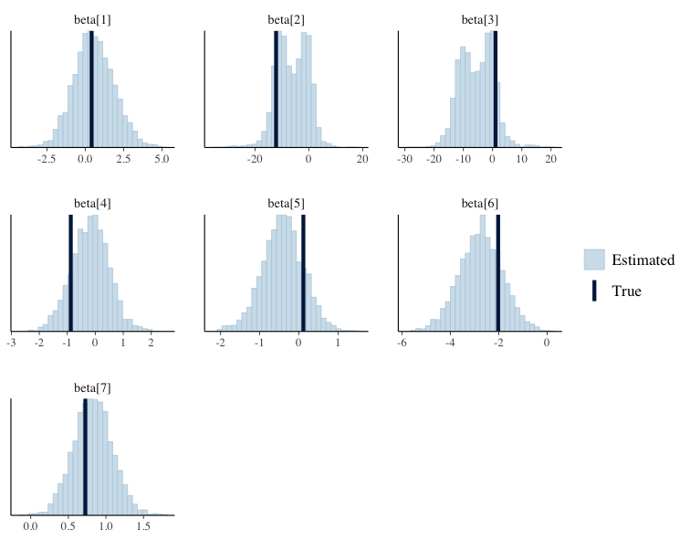
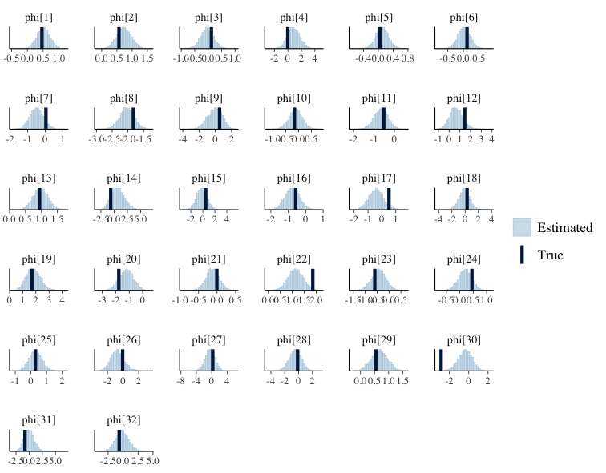
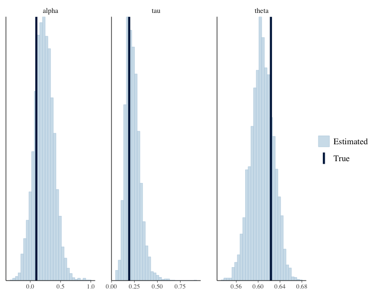
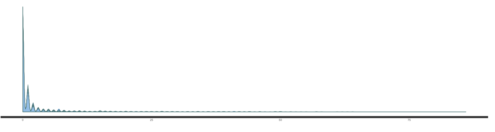
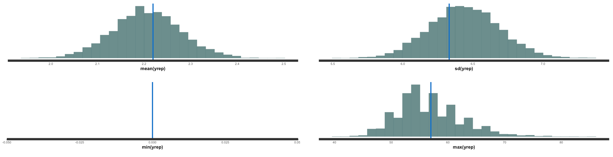
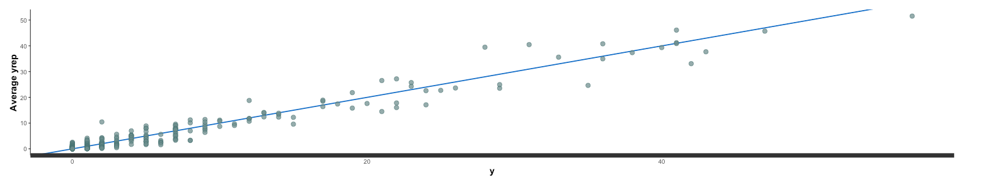
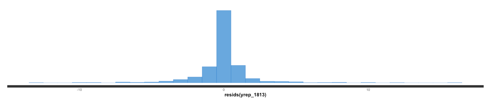
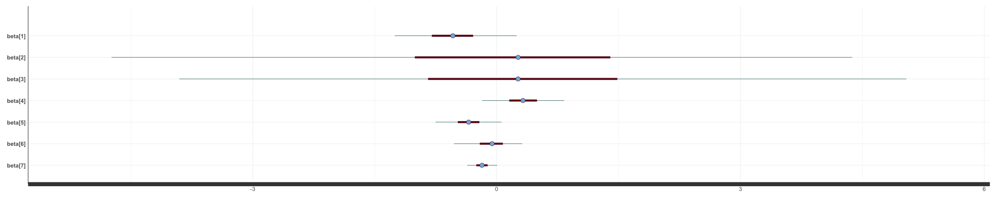
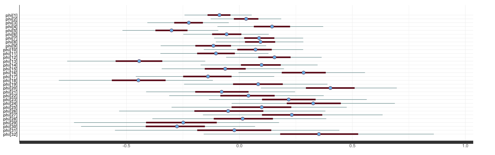
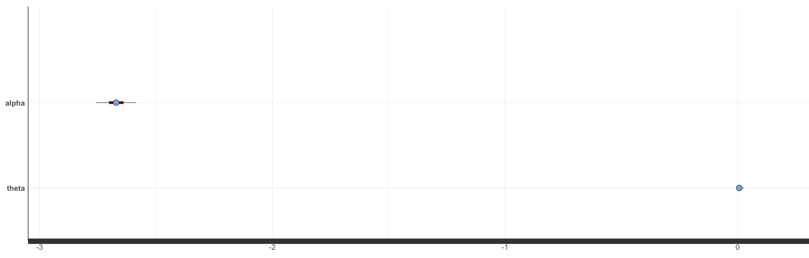

```{r setup, include=FALSE, echo=FALSE}
options(htmltools.dir.version = FALSE)
options(digits = 2)
library(ggplot2)
library(gridExtra)
library(knitr)
knitr::opts_chunk$set(cache = TRUE)
knitr::opts_chunk$set(tidy = FALSE, cache.extra = packageVersion('tufte'))
knitr::opts_chunk$set(comment = "")
library(reshape)
library(rstan)
rstan_options(auto_write = TRUE)
options(mc.cores = parallel::detectCores(logical = FALSE))
library(tufte)
ggtheme_tufte <- function() {
  theme(plot.background =
          element_rect(fill = "#fffff8",
                       colour = "#fffff8",
                       size = 0.5,
                       linetype = "solid"),
        plot.margin=unit(c(1, 1, 0.5, 0.5), "lines"),
        panel.background =
          element_rect(fill = "#fffff8",
                       colour = "#fffff8",
                       size = 0.5,
                       linetype = "solid"),
        panel.grid.major = element_line(colour = "white", size = 1, linetype="dashed"),
          # blank(),
        panel.grid.minor = element_blank(),
        legend.box.background =
          element_rect(fill = "#fffff8",
                       colour = "#fffff8",
                       linetype = "solid"),
        axis.ticks = element_blank(),
        axis.text = element_text(family = "Palatino", size = 16),
        axis.title.x = element_text(family = "Palatino", size = 20,
                                    margin = margin(t = 15, r = 0, b = 0, l = 0)),
        axis.title.y = element_text(family = "Palatino", size = 18,
                                    margin = margin(t = 0, r = 15, b = 0, l = 0)),
        strip.background = element_rect(fill = "#fffff8",
                                        colour = "#fffff8",
                                        linetype = "solid"),
        strip.text = element_text(family = "Palatino", size = 16),
        legend.text = element_text(family = "Palatino", size = 16),
        legend.title = element_text(family = "Palatino", size = 16,
                                    margin = margin(b = 5)),
        legend.background = element_rect(fill = "#fffff8",
                                        colour = "#fffff8",
                                        linetype = "solid"),
        legend.key = element_rect(fill = "#fffff8",
                                        colour = "#fffff8",
                                        linetype = "solid")
  )
}
printf <- function(msg = "%5.3f", ...) {
  cat(sprintf(msg, ...))
}
```


## Abstract {-}

# Data

## Introduction 

## Explortary Data Analysis

## Data Processin 

The data in our model has been processed the following steps:
* Take the log of 'client_income' and 'asset_market_value'. 

  Reason: The distribution of these two variables are highly right skewed with high-value outliers.
* Standardized the design matrix. 

  Reason: Improve the coverage of MCMC. 
Exclude intercept in the design matrix. Reason: variables are centered and the ICR model has been used.


# Baseline Model : Linear Binormial Regression


# Model Extension: CAR & Zero Inflation 

## A linear binormial regression analogy

Lik what we did in the baseline model. We process by treating the underlying deterministic model as providing an expected default times for each city around which there will be variation due to both measurement error and simplifications. Consider the typical formulation of a linear regression, where $y_n$ is the is an observable default time, $x_n$ is a row vector of unmodeled predictors ( independent variables), $\beta$ is a coefficient vector parameter and we separate the intercep as $a$. In the city level, we assume that the number of individual records in city $i$ is $n_i$.Thus, we have the model:

$$ y_i \sim Binormial(n_{i},logit^{-1}(a + x_i\beta)) $$
As a robust prior distribution option, we take $\beta \sim cauchy(location=0,scale=2.5)$.

In model 2, we will extend this model in two ways: (1) incoperate the geographic state information (2) zero inflated model.  

### Extension one: Incoperate Geographic Information

In this project, we utilize the IAR prior for state feature. Intrisnic conditional autoregressive (IAR)  is an extension of conditional autoregressive (CAR) models, which are popular as prior distributions for spatial random effects with areal spatial data. In our model, we have a random quantity $\phi = (\phi_1,\phi_2,...,\phi_{32})$ at 32 state areal locations. In each state, we have the individual records aggregated at the city level. And each city data belong to one state. According to the Brook's Lemma, the joint the distribution of $\phi$ can be expressed as the followings:
$$\phi \sim N(0,[D_{\tau} (I-\alpha B)]^{-1})$$
In this formula, we have:

* $D = diag(m_i)$ is an $32 \times 32$ diagonal matrix with $m_i$ is the number of the neighbors for the state i

* $D_{\tau} = \tau D$  and $\tau$ is the hyperparameter in the conditional distributions of the $\phi$

* $\alpha$ is the parameter that controls spatial dependence. In IAR, we let $\alpha =1$

* $B = D^{-1} W$ is the scaled adjacency matrix. And $W$ is the adjacency matrix. ($w_{ii}=0$,$w_{ij}=1$ if the state i is a neighbor of state j , and $w_{ij}=1$ otherwise)

We can simplifies the IAR model to:

$$\phi \sim N(0,\tau (D-W)]^{-1})$$
In IAR model, we have a singular precision matrix and an improper prior distribution. However, in practice, IAR models are fit with a sum to zero constrains: 
$\sum_{i}\phi_i = 0$ for each connected component of the graph. In this way, we can interpret both overall means and the component-wise means.

Through log probability accumulator, we can accure computational efficiency gains. We have:

$$log(p(\phi | \tau)) = -\frac{n}{2}log(2\pi) + \frac{1}{2}log(det^{*}(\tau(D-W))) - \frac{1}{2}\phi^{T}\tau(D-W)\phi$$
$$=-\frac{n}{2}log(2\pi) + \frac{1}{2}log(\tau^{n-k}) + \frac{1}{2}log(det^{*}(\tau(D-W))  - \frac{1}{2}\phi^{T}\tau(D-W)\phi$$

In this formula, $det^{*}(A)$ is the generlized determinant of the square matrix A defined as the product of its non-zero eigenvalues, and the k is the number of the connented component in the graph.(k=1 for our data) Dropping the additive constants, the qunantity to increment becomes:

$$  \frac{1}{2}log(\tau^{n-k}) - \frac{1}{2}\phi^{T}\tau(D-W)\phi $$

In  our model, we assume the hyperparameter $\tau \sim Gamma(shape = 2,rate = 2)$. We define the sparse_iar_lpdf function as a more efficient spare representation as the following:

```{r eval=FALSE}
functions {
  real sparse_iar_lpdf(vector phi, real tau, int[,] W_sparse, vector D_sparse, vector lambda, int S, int W_n) {
      row_vector[S] phit_D; // phi' * D
      row_vector[S] phit_W; // phi' * W
      vector[S] ldet_terms;
    
      phit_D = (phi .* D_sparse)';
      phit_W = rep_row_vector(0, S);
      for (i in 1:W_n) {
        phit_W[W_sparse[i, 1]] = phit_W[W_sparse[i, 1]] + phi[W_sparse[i, 2]];
        phit_W[W_sparse[i, 2]] = phit_W[W_sparse[i, 2]] + phi[W_sparse[i, 1]];
      }
    
      return 0.5 * ((S-1) * log(tau)
                    - tau * (phit_D * phi - (phit_W * phi)));
  }
}
```

After we get the IAR prior, we can take it into our model.For the $i$ the city in the $j$ the state, we have:

$$ y_{ij} \sim Binormial(n_{ij},logit^{-1}(a + \phi_j + x_{ij}\beta)) $$
* Reason for design the model in this way rather than hierarchical model:

1. Hierarchical extension will greatly expend the demension of the parameter space. Consequently, the estimation convergence would be much more difficult.Just focus on the binormial regression part. If we take the hierarchical extension both on the intercept and coefficient terms, there will have $32 \times 1 = 32$ intercept paramters and $32 \times 7 = 224$ coefficient parameters (total 256 parameters).For taking  the hierarchical extension on  $\beta$s, we have 1 intercept and $7 \times 32 = 224$ coefficient in the binormial regression model (total 225 parameters). But now, we only have 1 parameter for overall intercept, 32 parameter for the state level effecr and 7 parameter for the different independent variables' effects.

2. This design of model is better for interpreation and better for us to solve our research problems.Now the coefficient terms are not depend on the state prior. Thus, we can estimate the overall effect from these independent variables, like age and income. And on the state level effect, we can have the overall idea based on the estimated parameter values.

## Extension two: zero inflated model

Zero-inflated model originally provide mixture of a mixtures of a Poisson and Bernoulli probability mass function to allow more flexibility in modeling the probability of a zero outcome. Zero-inflated models, as defined by Lambert (1992), add additional probability mass to the outcome of zero. But, this extension can also be applied for other categorical distributions like binomial distribution we used in this project. 

We assume a parameter $\theta$ as the probability of drawing a zero and the probability $1-\theta$ as drawing fro mthe Binormal distribution. The prior distribution of  $\theta$ is uniform between 0 and 1, since we have no extra information about this parameter. The distribution function is thus:

$$p(y_n | \theta,a,\beta) =\begin{cases} 
\theta + (1-\theta) \times Binomial(0 |a,\beta,\phi ) & y_n =0 \\
(1-\theta) \times Binomial(0 |a,\beta,\phi )  & y_n > 0 \end{cases}$$

In stan, we estimate the model in this following ways:

```{r eval=FALSE}
for (j in 1:N_train){
    if (y[j] == 0){
      target += log_sum_exp(bernoulli_lpmf(1 | theta), bernoulli_lpmf(0 | theta) + binomial_logit_lpmf(y[j] | n_city_train[j],alpha[state_train[j]] + X_train[j,]* beta));
      }
    else{
      target += bernoulli_lpmf(0 | theta) + binomial_logit_lpmf(y[j] | n_city_train[j],alpha + X_train[j,] * beta);}
  }
```

And we predict the $y_{rep}$ in the following way:

```{r eval=FALSE}
generated quantities{
  int y_rep[N_train];
  real<lower =0,upper=1> zero_train[N_train];
  for (i in 1:N_train){
    zero_train[i] = uniform_rng(0,1);
    if (zero_train[i] < theta){
      y_rep[i] = 0;
      }
    else{
      y_rep[i] = binomial_rng(n_city_train[i],inv_logit(alpha[state_train[i]] + X_train[i,]* beta));
      }
  }
}
```


### Model Coveage testing wit fake data.

In this part, we first simulate the fake data as we assume in thie model. Then, we will check that our model works well with the data that we have simulated ourselves. In this following are the model coverage plots.

We now assessing the parameter recoverage of $\beta$ parameters.


In the plot plot is the parameter recoverage of $\phi$ parameters.

Finally, let's check the parameter recoverage of $\alpha,\theta,\tau$


As we can see, all the parameters in our fake data recover very well. This means it is reliable to use rstan to run this model.


### Model Check

##### Posterior Predict Check (PPC) 

In the plot below we have the kernel density estimate of the observed data (y, thicker curve) and 200 simulated data sets ($y_{rep}$, thin curves) from the posterior predictive distribution. If the model fits the data well, as it does here, there is little difference between the observed dataset and the simulated datasets.


As we can see from the polt below, $y_{rep}$ behavior well in the four most common statistics.  Ideally this vertical line would fall somewhere within the histogram, as what we did.


The plot below shows the observed and average simulated value. As we can see the model fit the data very well without obvious outliers.


The residuals centered at 0 and have small variance. This indecates that the model fit is acceptable.



### Cross Validation & MSE

In order to determine our model performance, again we do the 5-floder cross validation. And we calculate the MSE for each training dataset with our model. And then we get the average MSE. The stan code we used to simulate the $y_hat$ is as the following:

```{r eval=FALSE}
generated quantities{
  int y_rep_cv[N_test];
  real<lower =0,upper=1> zero_test[N_test];
  for (i in 1:N_test){
    zero_test[i] = uniform_rng(0,1);
    if (zero_test[i] < theta){
      y_rep_cv[i] = 0;
      }
    else{
      y_rep_cv[i] = binomial_rng(n_city_test[i],inv_logit( alpha[state_test[i]] + X_test[i,]* beta));
      }
  }
}
```


Acrroding to the result, the baseline MSE is 128164. But for our model, the average MSE is **7583** with the standard deviation **6831**. Thus, we can say that our model have a huge improve from the baseline.


### Model result

#### Brief results 
In the following is the basic model results:
```{r eval=FALSE}
           mean se_mean   sd    2.5%     25%     50%     75%     98% n_eff Rhat
alpha     -2.67    0.00 0.04   -2.76   -2.70   -2.67   -2.64   -2.59   187  1.0
beta[1]   -0.53    0.03 0.38   -1.25   -0.80   -0.54   -0.29    0.25   143  1.0
beta[2]    0.19    0.23 2.11   -4.74   -1.01    0.26    1.40    4.38    86  1.1
beta[3]    0.33    0.22 2.09   -3.91   -0.84    0.26    1.48    5.04    94  1.0
beta[4]    0.32    0.03 0.25   -0.18    0.16    0.32    0.50    0.83    97  1.1
beta[5]   -0.34    0.02 0.20   -0.75   -0.48   -0.34   -0.21    0.06   109  1.1
beta[6]   -0.07    0.02 0.21   -0.52   -0.21   -0.06    0.08    0.32   134  1.0
beta[7]   -0.18    0.01 0.10   -0.36   -0.25   -0.18   -0.11    0.01   217  1.0
phi[1]    -0.09    0.00 0.08   -0.24   -0.14   -0.09   -0.04    0.05   852  1.0
phi[2]     0.03    0.00 0.08   -0.13   -0.02    0.03    0.08    0.19  2025  1.0
phi[3]    -0.23    0.00 0.09   -0.41   -0.29   -0.22   -0.16   -0.05  1803  1.0
phi[4]     0.14    0.00 0.12   -0.10    0.06    0.14    0.22    0.37  1829  1.0
phi[5]    -0.30    0.00 0.11   -0.52   -0.37   -0.30   -0.23   -0.09  3299  1.0
phi[6]    -0.06    0.00 0.10   -0.25   -0.12   -0.06    0.01    0.13  2359  1.0
phi[7]     0.09    0.00 0.10   -0.11    0.02    0.09    0.15    0.28  2368  1.0
phi[8]     0.09    0.00 0.10   -0.10    0.02    0.09    0.16    0.28  2423  1.0
phi[9]    -0.12    0.00 0.12   -0.35   -0.20   -0.12   -0.04    0.12  3345  1.0
phi[10]    0.07    0.00 0.11   -0.16   -0.01    0.07    0.14    0.28  2464  1.0
phi[11]   -0.10    0.00 0.12   -0.35   -0.19   -0.10   -0.02    0.13  4003  1.0
phi[12]    0.16    0.00 0.11   -0.06    0.08    0.16    0.23    0.36  2948  1.0
phi[13]   -0.45    0.00 0.15   -0.76   -0.55   -0.44   -0.34   -0.15  3698  1.0
phi[14]    0.09    0.00 0.13   -0.17    0.01    0.10    0.18    0.35  3833  1.0
phi[15]   -0.06    0.00 0.14   -0.34   -0.15   -0.06    0.03    0.20  3366  1.0
phi[16]    0.28    0.00 0.14    0.00    0.19    0.28    0.38    0.56  2951  1.0
phi[17]   -0.14    0.00 0.16   -0.46   -0.25   -0.14   -0.03    0.15  4033  1.0
phi[18]   -0.45    0.00 0.18   -0.80   -0.56   -0.45   -0.33   -0.12  1581  1.0
phi[19]    0.08    0.00 0.16   -0.24   -0.03    0.08    0.19    0.39  4147  1.0
phi[20]    0.40    0.00 0.16    0.10    0.29    0.40    0.51    0.70  1102  1.0
phi[21]   -0.08    0.00 0.17   -0.41   -0.20   -0.08    0.04    0.25  4140  1.0
phi[22]    0.04    0.00 0.18   -0.31   -0.08    0.04    0.16    0.37  4044  1.0
phi[23]    0.22    0.00 0.18   -0.13    0.10    0.22    0.34    0.56  2248  1.0
phi[24]    0.33    0.00 0.18   -0.03    0.21    0.33    0.45    0.69  3626  1.0
phi[25]    0.10    0.00 0.20   -0.30   -0.03    0.10    0.23    0.47  3735  1.0
phi[26]   -0.05    0.00 0.23   -0.53   -0.20   -0.05    0.11    0.38  3186  1.0
phi[27]    0.23    0.00 0.20   -0.16    0.10    0.23    0.37    0.63  2633  1.0
phi[28]    0.01    0.00 0.20   -0.39   -0.11    0.01    0.15    0.38  3371  1.0
phi[29]   -0.26    0.00 0.23   -0.73   -0.41   -0.25   -0.10    0.18  2812  1.0
phi[30]   -0.29    0.00 0.20   -0.70   -0.41   -0.28   -0.15    0.07  1902  1.0
phi[31]   -0.03    0.00 0.25   -0.55   -0.19   -0.02    0.14    0.44  3394  1.0
phi[32]    0.35    0.00 0.26   -0.16    0.18    0.35    0.53    0.86  3258  1.0
theta      0.01    0.00 0.01    0.00    0.00    0.01    0.01    0.03   213  1.0
tau        2.49    0.05 0.84    1.23    1.88    2.37    2.98    4.46   240  1.0
lp__    -812.85    0.20 4.82 -823.32 -815.77 -812.58 -809.53 -804.33   593  1.0
```

A quick check for the Rhat in our model is all very good. The posterior confidence interval of the parameters are show as the following plots.


#### Confidence intervial and interpretation



As we can see above, the effect from the age is significant based on the 95% confidence interval. Other parameter are not significant enough.



The state effects are obvious. We can see that $\phi_3$ (QUERETARO DE ARTEAGA), $\phi_5$ (GUANAJUATO) , $\phi_{13}$ (AGUASCALIENTES) and $\phi_{18}$ (VERACRUZ LLAVE) have the nigative effect, which means these state is less likely to have default. However, $\phi_{20}$ (MICHOACAN DE OCAMPO) has a significantly postive effect.



As we can see, the overall offset effect is obvious that for about -2.67. And on avrage, there will have 1% of cities have no default at all. On 95% confidence interval, there will have less than 3% of cities have no default.


# Conclusion


# Exercises and Extensions
## Model discussion: Individual level Analysis

In the past chapters, we focus on the city level analysis. In this way, we simplified our data set and clearified our model design ideas. More importantly, it saves a lot of time to run this model in city level. However, in reality, people may also interested in the individual default risk. Besides, some independent variables like average age is not make so much sense.

In this chapter, we will instead run the model for the individual level. For individual level, it's more resonable to use the logistic regression instead of the binormial regression. 
$$p(y_i) =\begin{cases} 
1, & defaule \space at \space least \space once \\
0, & otherwise \end{cases}$$
However, the CAR  still can be used.Thus, the new model for individual level can be summarized as these:
$$ y_{ij} \sim bernoulli(logit^{-1}(a + \phi_j + x_{ij}\beta)) $$
As the same the zero-inflated model extension will also be applied in the individual level.
$$p(y_i | \theta,a,\beta) =\begin{cases}  
\theta + (1-\theta) \times bernoulli(0 |a,\beta,\phi ) & y_i =0 \\
(1-\theta) \times bernoulli(0 |a,\beta,\phi )  & y_i > 0 \end{cases}$$

The model result is in the following:
```{r eval=FALSE}


```

## Other Discussion

This case study's idea can be easily applied and extended for realistic applications in several obvious ways. Just like we did in the individual level analysis. There are some other thinking about this case study.

1.  *Simulation-based calibration*.  Write a Stan model to simulate data from this model.  First simulate parameters from the prior (or pick ones consistent with the priors).  Then simulate data from the parameters.  Finally, fit the model in Stan and compare the coverage as in the last plot in the case study.

2.  *Forecasting and backcasting*.  Extend predictions another 50 years into the future and plot as in the last plot.  This can be done by extending the solution points in the transformed parameters, but is more efficiently done in the generated quantities block.  Next, extend the predictions 50 years into the past and plot.

3.  *Missing data*.  Suppose that several of the measurements are missing.  Write a Stan program that uses only the observed measurements.  This will require coding the data in long form.  Only this part of the model changes; the ODE is set up and fit as before with the complete set of time points. What happens to the computation and posterior inferences as increasing amounts of data are missing? How can the missing data points be imputed using the generated quantities block?38

4. *Error model*. Replace the lognormal error with a simple normal error model. What does this do to the z estimates and to the basic parameter estimates? Which error model fits better?

5. *Sensitivity analysis and prior choice*. Perform a sensitivity analysis on the prior choices made for this model. When the prior means or scales are varied, how much does the posterior vary? Does the model become easier or harder to fit (in terms of effective sample size per unit time or divergent transitions) with different prior choices? What does this imply about the number of digits with which we report results and thus the effective sample sizes necessary for most inferences?

6. *Model misspecification*. Swap the coding of the lynx and hare in the input so that the predator is modeled as prey and vice-versa. How well does it fit the data? How does this provide evidence for the folk theorem?


## References {-}

* Besag, Julian, Jeremy York, and Annie Mollié. (1991)  Bayesian image restoration, with two applications in spatial statistics. *Annals of the institute of statistical mathematics*, 43.1: 1-20.
* Gelfand, Alan E., and Penelope Vounatsou. (2003) Proper multivariate conditional autoregressive models for spatial data analysis. *Biostatistics* 4.1: 11-15.
* Jin, Xiaoping, Bradley P. Carlin, and Sudipto Banerjee. (2005) Generalized hierarchical multivariate CAR models for areal data. *Biometrics*  61.4: 950-961.
* Bob Carpenter. (2018) [Predator-Prey Population Dynamics: 
the Lotka-Volterra model in Stan](http://mc-stan.org/users/documentation/case-studies/lotka-volterra-predator-prey.html#data-lynx-and-hare-pelts-in-canada). *Rstan Document For Example*.
* Max Joseph. (2011) [Exact sparse CAR models in Stan](http://mc-stan.org/users/documentation/case-studies/mbjoseph-CARStan.html). *Rstan Document For Example*.
* Stan Development Team (2017) *Stan Modeling Language Users Guide and Reference Manual*, Version 2.17, [http://mc-stan.org](http://mc-stan.org).
* Vehtari, A., Gelman, A. & Gabry, J. (2017) Practical Bayesian model evaluation using leave-one-out cross-validation and WAIC.   *Journal of Statistics and Computing* 27(5):1413--1432.
* Andrew Gelman, John B. Carlin, Hal S. Stern, David B. Dunson, Aki Vehtari, Donald B. Rubin (2014) [*Bayesian Data Analysis*](https://www.google.com/search?q=bayesian+data+analysis&oq=bayesian+data+analysis&aqs=chrome.0.69i59j69i60l2j69i61j69i65j0.3253j1j4&sourceid=chrome&ie=UTF-8)
* Stan Development Team (2018) [*Bayesian Statistics Using Stan*](http://www.stat.columbia.edu/~gelman/bda.course/_book/)

## Source code {-}
All of the source code, data, text, and images for this case study are available on GitHub at：
* [A bayesian approach to indentify morgage default rate at city level](https://github.com/ChrisChen0429/BDA_project)

## Complete Stan program {-}
The complete Stn program for this case study are  available on the google at:
* [A bayesian approach to indentify morgage default rate at city level](https://docs.google.com/document/d/1N0XtUlnsnYi_bInkrbTQG2DCD1Hf7mXaSoZWQbWrOqg/edit?usp=sharing)


## Acknowledgements {-}
Thanks to Simon Woodward, Arya Pourzanjani, and Leo Lahti for helpful comments on earlier drafts and Peter Howard for providing the provenance of the data and the original case study with the data.

<br />


## Session information  {-}
<div style="font-size:90%">
```{r}
sessionInfo()
```
</div>

## Licenses  {-}

<span style="font-size:85%">Code &copy; 2017--2018, Columbia University in New York, licensed under BSD-3.</span>

<span style="font-size:85%">Text &copy; Andres Potapczynski, Jongwoo Choi, Yi Chen </span>
